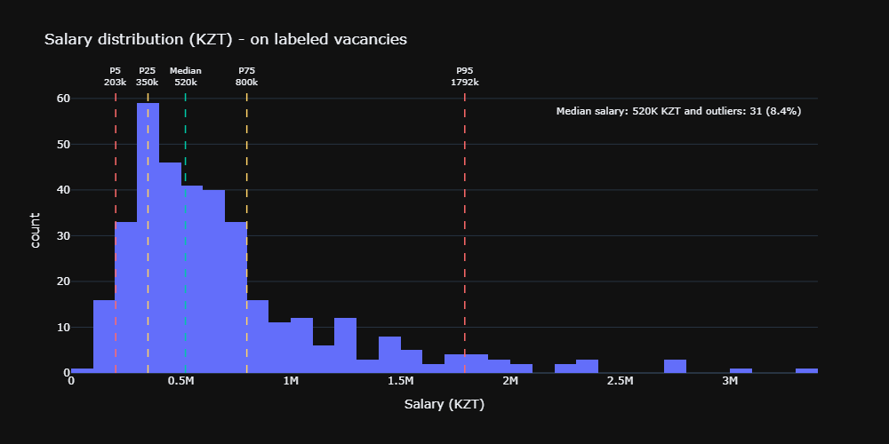

# KZ IT JobScope - IT job market analysis in Kazakhstan

Analysis of 1000+ IT job postings from hh.kz across Kazakhstan,
with exploratory data analysis, skill extraction, an interactive salary prediction app based on tech stack, and role features

**[Live Demo](#)** · **[Dataset](https://raw.githubusercontent.com/Batyrkhantzy111/ml-jobs-kz-salary-prediction/refs/heads/main/data/processed/vacancies_clean_2026-04-14.csv)**

---

## Overview
This project analyzes vacancies from hh.kz to explore the Kazakhstan IT job market

The pipeline includes:
- data collection from hh.kz
- data cleaning and preprocessing
- exploratory data analysis
- skill extraction from vacancy descriptions
- salary prediction using machine learning
- interactive Streamlit app for market insights and salary estimation

## Stack
`Python` `pandas` `scikit-learn` `XGBoost` `SHAP`  
`Plotly` `kaleido` `Streamlit` `BeautifulSoup` `requests`
`optuna` `scipy`

## Results
- **Labeled salary rows:** 367/1176 vacancies (**31.2%**)
- **Best model:** **XGBoost**
- **Cross-validated metrics (5-fold CV × 10 repeats):**
  - **MAE:** 265_656 KZT
  - **RMSE:** 417_003 KZT
  - **R²:** 0.330 ± 0.098

The model is best treated as an exploratory market approximation rather than an exact salary prediction tool

## Why the regression metrics are low

The regression quality is limited mostly by the data, not only by the model choice

- **Only 367 vacancies contain salary labels**  
  That is just **31.2%** of the cleaned dataset, which is a very small supervised sample for a regression problem with many categorical and sparse skill features

- **Salary variance is very high**  
  In the labeled subset, the median salary is about **520K KZT**, the 95th percentile is about **1.792M KZT**, and the maximum is about **3.339M KZT**. This makes the target noisy and harder to predict
  

- **The target itself is approximate**  
  The model predicts `salary_mid`, which is computed from `salary_from` / `salary_to`. Many vacancies have only one salary bound, some salaries were manually converted from hourly estimates to monthly values, and gross/net differences are still present in the raw data. All of this adds target noise

- **Salary sharing is not random**  
  Most vacancies do not publish salary, and the labeled subset is uneven across roles, experience levels, and cities. That means the model is trained on a biased slice of the market rather than on the full vacancy distribution.

- **Features are informative, but still too general**  
  The model uses city, employment type, experience, inferred grade, work format, and a binary technology stack. These features help, but they do not capture company level, business domain, team size, seniority depth, leadership scope, english level, or compensation policies

- **Skill features are sparse and lose context.**  
  Skills are extracted from vacancy text and then converted to binary flags. This keeps the model simple and easy to read, but it removes context such as skill depth, required years of experience, and whether a technology is central or only mentioned once.

Because of these limitations, a relatively low R² is expected here. In this project, the model is better interpreted as a **market approximation tool** than as an exact salary predictor

## How to run
```bash
pip install -r requirements.txt

# Run app (will be then)
streamlit run app.py
```

## Project Structure
```
├── notebooks/
│   ├── 00_extract_data.ipynb
│   ├── 01_eda.ipynb
│   ├── 02_nlp.ipynb
│   └── 03_model.ipynb
├── data/
│   ├── raw/raw_vacancies.csv
│   ├── processed/
│   │   ├── vacancies_clean.csv
│   │   ├── features_nlp.csv
│   │   └── unlabeled_salary_predictions.csv
│   └── vizualizations/
│       ├── viz_1.png
│       ├── viz_1.html
│       ├── viz_2.png
│       ├── viz_2.html
│       └── ...
├── models/salary_model.pkl
├── app.py
└── requirements.txt
```
